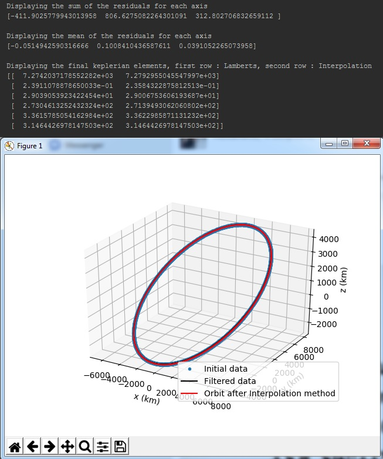
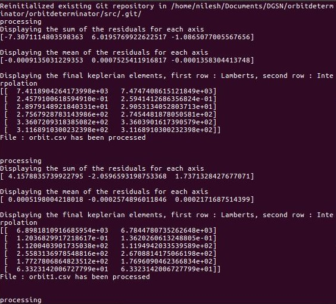
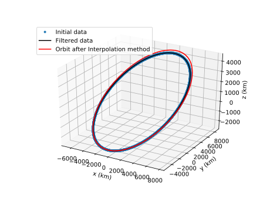
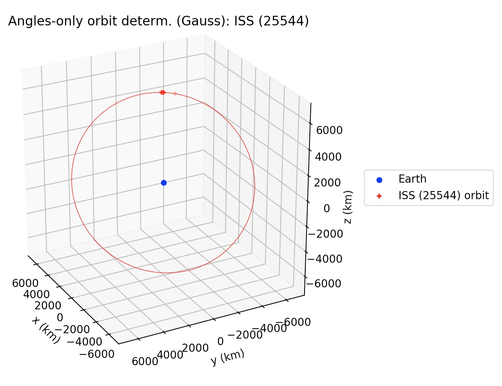
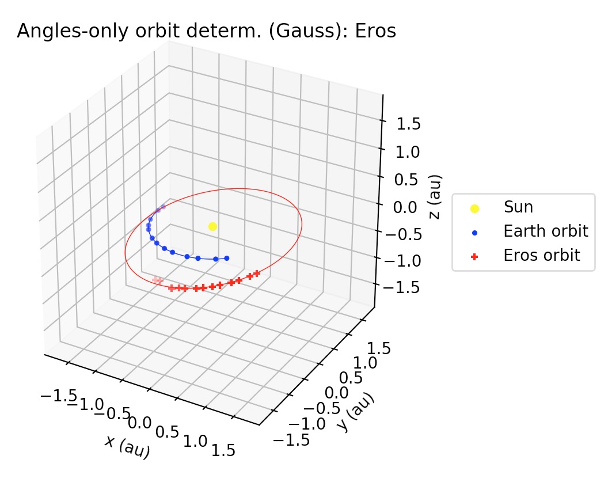
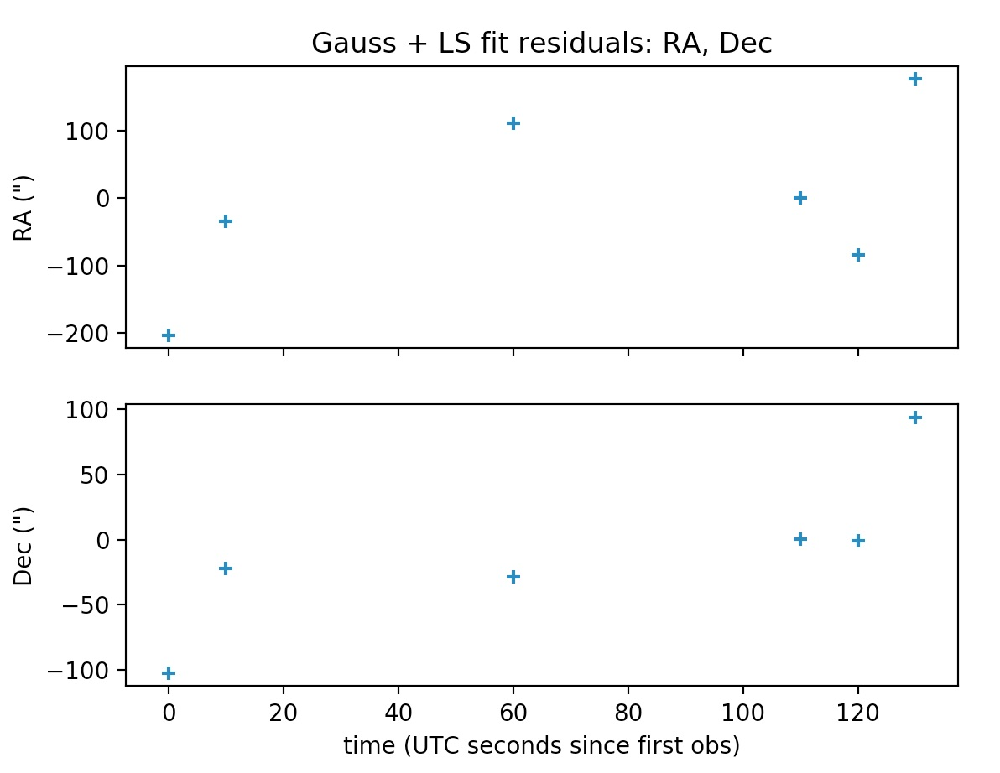
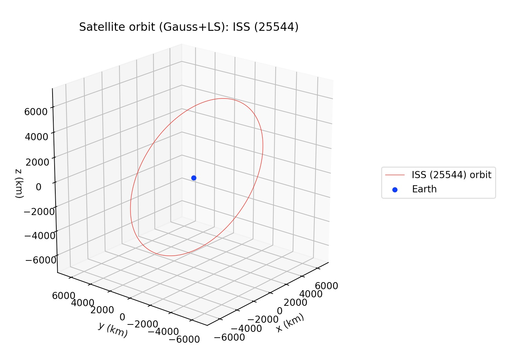

+++++++++
Tutorials
+++++++++

==============================
* Run the program with main.py
==============================

For the first example we will showcase how you can use the full features of the package
with main.py. Simply executing the main.py by giving the name of .csv file that contains
the positional data of the satellite, as an argument in the function process(data_file)::

    def process(data_file, error_apriori):
        '''
        Given a .csv data file in the format of (time, x, y, z) applies both filters, generates a filtered.csv data
        file, prints out the final keplerian elements computed from both Lamberts and Interpolation and finally plots
        the initial, filtered data set and the final orbit.

        Args:
            data_file (string): The name of the .csv file containing the positional data
            error_apriori (float): apriori estimation of the measurements error in km

        Returns:
            Runs the whole process of the program
        '''

Simply input the name of the .csv file in the format of (time, x, y, z) and **tab delimiter** like the orbit.csv that is
located in the src folder and the process will run. You also need to input a apriori estimation of the measurements
errors, which in the example case is 20km per point (points every 1 second). In the case you are using your own
positional data set you need to estimate this value and input it because it is critical for the filtering process::

    run = process("orbit.csv")

.. warning::

   If the format of you data is (time, azimuth, elevation, distance) you can use the input_transf function first and be sure that the delimiter for the data file is tab delimiter since this is the one read_data supports.

The process that will run with the use of the process function is, first the program reads your data from the .csv file
then, applies both filters (Triple moving average and Savintzky - Golay), generates a .csv file called filtered, that included the filtered data set,
computes the keplerian elements of the orbit with both methods (Lamberts - Kalman and Spline Interpolation) and finally prints and plots some results.
More specifically, the results printed by this process will be first the sum and mean value of the residuals
(difference between filtered and initial data), the computed keplerian elements in format of (a - semi major axis,
e - eccentricity, i - inclination, ω - argument of perigee, Ω - right ascension of the ascending node,
v - true anomaly) and a 3d matplotlib graph that plots the initial, filtered data set and the final computed orbit
described by the keplerian elements (via the interpolation method).

Process
~~~~~~~

- Reads the data
- Uses both filters on them (Triple moving average and Savintzky - Golay )
- Generates a .csv file called filtered that includes the filtered data set
- Computes keplerian elements with both methods (Lamberts - Kalman and Spline Interpolation)
- Prints results and plot a 3d matplotlib graph

Results
~~~~~~~

- Sum and mean of the residuals (differences between filtered and initial data set)
- Final keplerian elements from both methods (first column : Lamberts - Kalman, second column : Spline Interpolation)
- 3d matplotlib graph with the initial, filtered data set and the final orbit described by the keplerian elements from Spline Interpolation

.. warning::

   Measurement unit for distance is kilometer and for angle degrees

The output should look like the following image.

====================================
* Run the program with automated.py
====================================

`automated.py` is another flavour of main.py that is supposed to run on a server. It keeps listening for new files in a particular directory and processes them when they arrive.  

.. note::
   All the processing invloved in this module is identical to that of main.py.

For testing purpose some files have already put in a folder named src. These are raw unprocessed files. There is another folder named dst which contains processed files along with a graph saved in the form of svg.

To execute this script, change the directory to the script's directory::

   cd orbitdeterminator/

and run the code using python3::

   python3 automated.py

and thats it. This will keep listening for new files and process them as they arrive.

Process
~~~~~~~

- Initialize an empty git repository in src folder
- Read the untracked files of that folder and put them in a list
- Process the files in this list and save the results(processed data and graph) to dst folder
- Stage the processed file in the src folder in order to avoid processing the same files multiple times.
- Check for any untracked files in src and apply steps 2-4 again.

========================
* Using certain modules
========================

In this example we are not going to use the main.py, but some of the main modules provided. First of all lets clear the
path we are going to follow which is fairly straightforward. Note that we are going to use the same orbit.csv that is
located inside the src folder and has **tab delimeter** (read_data.py reads with this delimiter).

Process
~~~~~~~
- Read the data
- Filter the data
- Compute keplerian elements for the final orbit

So first we read the data using the util/read_data.load_data function. Just input the .csv file name into the
function and it will create a numpy array with the positional data ready to be processed::

    data = read_data.load_data("orbit.csv")

.. warning::

   If the format of you data is (time, azimuth, elevation, distance) you can use the util/input_transf.spher_to_cart
   function first. And it is critical for the x, y, z to be in kilometers.

We continue by applying the Triple moving average filter::

    data_after_filter = triple_moving_average.generate_filtered_data(data, 3)

We suggest using 3 as the window size of the filter. Came to this conclusion after a lot of testing. Next we apply
the second filter to the data set which will be of a larger window size so that we can smooth the data set in
a larger scale. The optimal window size for the Savintzky - Golay filter is being computed by the function
golay_window.c(error_apriori) in which we only have to input the apriori error estimation for the initial data set
(or the measurements error)::

    error_apriori = 20.0
    c = golay_window.c(error_apriori)

    window = len(data) / c
    window = int(window)

The other 2 lines after the use of the golay_window.c(error_apriori) are needed to compute the window size for the
Savintzky - Golay filter and again for the polynomial parameter of the filter we suggest using 3::

    data_after_filter = sav_golay.golay(data_after_filter, window, 3)

At this point we have the filtered positional data set ready to be inputed into the
Lamberts - Kalman and Spline interpolation algorithms so that the final keplerian elements can be computed::

    kep_lamb = lamberts_kalman.create_kep(data_after_filter)
    kep_final_lamb = lamberts_kalman.kalman(kep_lamb, 0.01 ** 2)
    kep_inter = interpolation.main(data_after_filter)
    kep_final_inter = lamberts_kalman.kalman(kep_inter, 0.01 ** 2)

With the above 4 lines of code the final set of 6 keplerian elements is computed by the two methods.
The output format is (semi major axis (a), eccentricity (e), inclination (i), argument of perigee (ω),
right ascension of the ascending node (Ω), true anomaly (v)). So finally, in the variables kep_final_lamb and
kep_final_inter a numpy array 1x6 has the final computed keplerian elements.

.. warning::

   If the orbit you want to compute is polar (i = 90) then we suggest you to use only the interpolation method.

===========================
Using ellipse_fit method
===========================

If a lot of points are available spread over the entire orbit, then the ellipse fit method can be used for orbit 
determination. The module ``kep_determination.ellipse_fit`` has two methods - ``determine_kep`` and ``plot_kep``. 
As the name suggests, ``determine_kep`` is used to determine the orbit and ``plot_kep`` is used to plot it. 
Call ``determine_kep`` with::

    kep,res = determine_kep(data)

where *data* is a nx3 numpy array. The ellipse_fit method does not use time information at all. Hence, the 
input format is *[(x,y,z),...]*. The method results two arguments - the first output is the Keplerian 
elements while the second output is the list of residuals.

Plot the results using the ``plot_kep`` method. Call it with::

    plot_kep(kep,data)

where *kep* is the Keplerian elements we got in the last step and data is the original data. The result should 
look like this.

.. figure:: ellipse_fit.png

===========================
Using propagation modules
===========================

Cowell Method
~~~~~~~~~~~~~~

The module ``propagation.cowell`` propagates a satellite along its orbit using numerical integration. It takes 
into account the oblateness of the Earth and atmospheric drag. The module has many methods for calculating 
drag and J2 acceleration, and integrating them. However, here we will discuss only the important ones. One is 
``propagate_state`` and the other is ``time_period``. ``propagate_state`` propagates a state vector from t1 to t2.
``time_period`` finds out the nodal time period of an orbit, given a state vector. Call ``propagate_state`` like this.::

    sf = propagate_state(si,t0,tf)

where si is the state at t0 and sf is the state at tf.

.. note::
    In all propagation related discussions a state vector is the numpy array *[rx,ry,rz,vx,vy,vz]*.

Similarly to find out time period call ``time_period`` like this.::

    t = time_period(s)

DGSN Simulator
~~~~~~~~~~~~~~~

The module ``propagation.dgsn_simulator`` can be used for simulating the DGSN. Given a satellite, it propagates 
the satellite along its orbit and periodically outputs its location. The location will have some associated with 
it. Observations will also not be exactly periodic. There will be slight variations. And sometimes observations 
might not be available (for example, the satellite is out of range of the DGSN).

To use this simulator, 3 classes are used.

- The SimParams class - This is a collection of all the simulation parameters.
- The OpWriter class - This class tells the simulator what to do with the output.
- The DGSNSimulator class - This is the actual simulator class.

To start, we must choose an OpWriter class. This will tell the simulator what to do with the output. To use it, 
extend the class and override its ``write`` method. Several sample classes have been provided. For this example we 
will use the default ``print_r`` class. This just prints the output.

Now create a SimParams object. For now, only set the kep, epoch and t0.::

    epoch = 1531152114
    t0 = epoch
    iss_kep = np.array([6785.6420,0.0003456,51.6418,290.0933,266.6543,212.4306])

    params = SimParams()
    params.kep = iss_kep
    params.epoch = epoch
    params.t0 = t0

Now initialize the simulator with these parameters and start it.::

    s = DGSNSimulator(params)
    s.simulate()

The program should start printing the time and the corresponding satellite coordinates on the terminal.

.. note::

    The module ``propagation.simulator`` is similar to this module. The only difference is that it doesn't 
    add any noise. So it can be used for comparison purposes.

Kalman Filter
~~~~~~~~~~~~~~

The module ``propagation.kalman_filter`` can be used to combine observation data and simulation data with a 
Kalman Filter. This module keeps on checking a file for new observation data and applies the filter accordingly. 
We can use the DGSN Simulator module to create observation data in real time. First, we must setup the simulator. 
We must configure it to save the output to a file instead of printing it. For this, we will use the in-built 
``save_r`` class.

Run the simulator with the following commands.::

    epoch = 1531152114
    t0 = epoch
    iss_kep = np.array([6785.6420,0.0003456,51.6418,290.0933,266.6543,212.4306])

    params = SimParams()
    params.kep = iss_kep
    params.epoch = epoch
    params.t0 = t0
    params.r_jit = 15
    params.op_writer = save_r('ISS_DGSN.csv')

    s = DGSNSimulator(params)
    s.simulate()

Now the program will start writing observations into the file ``ISS_DGSN.csv``. Now we need to setup the Kalman 
Filter with the same parameters. Use ``util.new_tle_kep_state`` to convert Keplerian elements into a state 
vector. In this tutorial, it is already done. Run the filter by passing the state and the name of the file to read.::

    s = np.array([2.87327861e+03,5.22872234e+03,3.23884457e+03,-3.49536799e+00,4.87267295e+00,-4.76846910e+00])
    t0 = 1531152114
    KalmanFilter().process(s,t0,'ISS_DGSN.csv')

The program should start printing filtered values on the terminal.

======================
Using utility modules
======================

new_tle_kep_state
~~~~~~~~~~~~~~~~~~

``new_tle_kep_state`` is used to convert a TLE or a set of Keplerian elements into a state vector. To convert a TLE 
make an array out of the 2nd line of the TLE. The array should be of the form:

- tle[0] = inclination (in degrees)
- tle[1] = right ascension of ascending node (in degrees)
- tle[2] = eccentricity
- tle[3] = argument of perigee (in degrees)
- tle[4] = mean anomaly (in degrees)
- tle[5] = mean motion (in revs per day)

Now call ``tle_to_state``. For example::

    tle = np.array([51.6418, 266.6543, 0.0003456, 290.0933, 212.4518, 15.54021918])
    r = tle_to_state(tle)
    print(r)

Similarly a Keplerian set can also be converted into a state vector.

teme_to_ecef
~~~~~~~~~~~~~

``teme_to_ecef`` is used to convert coordinates from TEME frame (inertial frame) to ECEF frame (rotating Earth fixed frame). 
The module accepts a list of coordinates of the form *[t1,x,y,z]* and outputs a list of latitudes, longitudes and altitudes 
in Earth fixed frame. These coordinates can be directly plotted on a map.

For example::

    ecef_coords = conv_to_ecef(np.array([[1521562500,768.281,5835.68,2438.076],
                                         [1521562500,768.281,5835.68,2438.076],
                                         [1521562500,768.281,5835.68,2438.076]]))

The resulting latitudes and longitudes can be directly plotted on an Earth map to visualize the satellite location with respect 
to the Earth.

====================================================
Gauss method: Earth-centered and Sun-centered orbits
====================================================

In this section, we will show a couple of examples to determine the orbit of
Earth satellites and Sun-orbiting minor planets, from right ascension and
declination tracking data, using the Gauss method.

gauss_method_sat
~~~~~~~~~~~~~~~~

``gauss_method_sat`` allows us to determine the Keplerian orbit of an Earth satellite from
a file containing right ascension and declination ("ra/dec", for short)
observations in IOD format. The IOD format is described at: 
http://www.satobs.org/position/IODformat.html. For this example, we will use the
file "SATOBS-ML-19200716.txt"in the `example_data` folder, which corresponds to
ra/dec observations of the ISS performed in July 2016 by Marco Langbroek, who
originally posted these observations at the mailing list of the satobs
organization (http://www.satobs.org).

First, we import the `least_squares` submodule::

    from orbitdeterminator.kep_determination.gauss_method import gauss_method_sat

Then, in the string `filename` we specify the path of the file where the
IOD-formatted data has been stored. In the `bodyname` string, we type an
user-defined identifier for the satellite:::

    # path of file of ra/dec IOD-formatted observations
    # the example contains tracking data for ISS (25544)
    filename = '/full/path/to/example_data/SATOBS-ML-19200716.txt'

    # body name
    bodyname = 'ISS (25544)'

Note that the each line in `filename` must refer to the same satellite. Next, we
select the observations that we will use for our computation. Our file
has actually six lines, but we will select only observations 2 through 5:::

    #lines of observations file to be used for preliminary orbit determination via Gauss method
    obs_arr = [1, 4, 6]

Remember that the Gauss method needs at least three ra/dec observations, so if
selecting `obs_arr` consisted of more observations, then `gauss_method_sat`
would take consecutive triplets. For example if we had `obs_arr = [2, 3, 4, 5]`
then Gauss method would be performed over (2,3,4), and then over (3,4,5).
The resulting orbital elements correspond to an average over these triplets. Now,
we are ready to call the `gauss_method_sat` function::

    x = gauss_method_sat(filename, bodyname, obs_arr)

The variable `x` stores the set of Keplerian orbital elements determined from
averaging over the consecutive observation triplets as described above. The
on-screen output is the following:::

    *** ORBIT DETERMINATION: GAUSS METHOD ***
    Observational arc:
    Number of observations:  3
    First observation (UTC) :  2016-07-20 01:31:32.250
    Last observation (UTC) :  2016-07-20 01:33:42.250

    AVERAGE ORBITAL ELEMENTS (EQUATORIAL): a, e, taup, omega, I, Omega, T
    Semi-major axis (a):                  6693.72282229624 km
    Eccentricity (e):                     0.011532050419770104
    Time of pericenter passage (tau):     2016-07-20 00:45:14.648 JDUTC
    Argument of pericenter (omega):       252.0109594208592 deg
    Inclination (I):                      51.60513143468057 deg
    Longitude of Ascending Node (Omega):  253.86985926046927 deg
    Orbital period (T):                   90.83669828522193 min

Besides printing the orbital elements in human-readable format,
`gauss_method_sat` prints a plot of the orbit.

If the user wants to supress the plot from the output, then the optional
argument `plot` must be set as `plot=False` in the function call.

gauss_method_mpc
~~~~~~~~~~~~~~~~

``gauss_method_mpc`` allows us to determine the Keplerian orbit of a Sun-orbiting body
(e.g., asteroid, comet, etc.) from a file containing right ascension and
declination ("ra/dec", for short) observations in the Minor Planet Center (MPC)
format. MPC format for optical observations is described at
https://www.minorplanetcenter.net/iau/info/OpticalObs.html. A crucial difference
with respect to the Earth-centered orbits is that the position of the Earth with
respect to the Sun at the time of each observation must be known. For this, we
use internally the JPL DE432s ephemerides via the `astropy` package
(astropy.org). For this example, we
will use the text file "mpc_eros_data.txt" from the `example_data` folder, which
corresponds to 223 ra/dec observations of the Near-Earth asteroid Eros performed
from March through July, 2016 by various observatories around the world, and
which may be retrieved from https://www.minorplanetcenter.net/db_search.

First, we import the `least_squares` submodule::

    from orbitdeterminator.kep_determination.gauss_method import gauss_method_mpc

Then, in the string `filename` we specify the path of the file where the
MPC-formatted data has been stored. In the `bodyname` string, we type an
user-defined identifier for the celestial body::

    # path of file of optical MPC-formatted observations
    filename = '/full/path/to/example_data/mpc_eros_data.txt'

    #body name
    bodyname = 'Eros'

Next, we select the observations that we will use for our computation. Our file
has 223 lines, but we will select only 13 observations from that file::

    #lines of observations file to be used for orbit determination
    obs_arr = [1, 14, 15, 24, 32, 37, 68, 81, 122, 162, 184, 206, 223]

Remember that the Gauss method needs at least three ra/dec observations, so if
selecting `obs_arr` consisted of more observations, then `gauss_method_mpc`
would take consecutive triplets. In this particular case we selected 13
observations, so the Gauss method will be performed over the triplets
(1, 14, 15), (14, 15, 24), etc. The resulting orbital elements correspond to an
average over these triplets. Now, we are ready to call the `gauss_method_mpc`
function::

    x = gauss_method_mpc(filename, bodyname, obs_arr)

The variable `x` stores the set of heliocentric, ecliptic Keplerian orbital
elements determined from averaging over the consecutive observation triplets as
described above. The on-screen output is the following::

    *** ORBIT DETERMINATION: GAUSS METHOD ***
    Observational arc:
    Number of observations:  13
    First observation (UTC) :  2016-03-12 02:15:09.434
    Last observation (UTC) :  2016-08-04 21:02:26.807

    AVERAGE ORBITAL ELEMENTS (ECLIPTIC, MEAN J2000.0): a, e, taup, omega, I, Omega, T
    Semi-major axis (a):                  1.444355337851336 au
    Eccentricity (e):                     0.23095833398719623
    Time of pericenter passage (tau):     2015-07-29 00:08:51.758 JDTDB
    Pericenter distance (q):              1.1107694353356776 au
    Apocenter distance (Q):               1.7779412403669947 au
    Argument of pericenter (omega):       178.13786236175858 deg
    Inclination (I):                      10.857620761026277 deg
    Longitude of Ascending Node (Omega):  304.14390758395615 deg
    Orbital period (T):                   631.7300241576686 days

Besides printing the orbital elements in human-readable format,
`gauss_method_mpc` prints a plot of the orbit.

If the user wants to supress the plot from the output, then the optional
argument `plot` must be set as ``plot=False`` in the function call.

====================================================================================
Least squares method for ra/dec observations: Earth-centered and Sun-centered orbits
====================================================================================

In the next two examples we will explain the usage of the least-squares method
functions for orbit determination from topocentric ra/dec angle measurements.
Currently, the implementation uses equal weights for all observations, but in
the future the non-equal weights case will be handled. At the core of the
implementation lies the `scipy.least_squares` function, which finds the set of
orbital elements which best fit the observed data. As an a priori estimate for
the least squares procedure, the Gauss method is used for an user-specified
subset of the observations.

gauss_LS_sat
~~~~~~~~~~~~

``gauss_LS_sat`` allows us to determine the Keplerian orbit of an Earth satellite from
a file containing right ascension and declination ("ra/dec", for short)
observations in IOD format, using the least-squares method. The IOD format is
described at:  http://www.satobs.org/position/IODformat.html. For this example,
we will use the file "SATOBS-ML-19200716.txt"in the `example_data` folder, which
corresponds to 6 ra/dec observations of the ISS performed in July 2016 by Marco
Langbroek, who originally posted these observations at the mailing list of the
satobs organization (http://www.satobs.org).::

    from orbitdeterminator.kep_determination.least_squares import gauss_LS_sat
    # body name
    bodyname = 'ISS (25544)'
    # path of file of ra/dec IOD-formatted observations
    # the example contains tracking data for ISS (25544)
    filename = '/full/path/to/example_data/SATOBS-ML-19200716.txt'
    #lines of observations file to be used for preliminary orbit determination via Gauss method
    obs_arr = [2, 3, 4, 5] # ML observations of ISS on 2016 Jul 19 and 20
    x = gauss_LS_sat(filename, bodyname, obs_arr, gaussiters=10, plot=True)

Note that `obs_arr` lists the observations to be used in the preliminary orbit
determination using Gauss method; whereas the least squares fit is performed
against *all* observations in the file. The output is the following::

    *** ORBIT DETERMINATION: GAUSS METHOD ***
    Observational arc:
    Number of observations:  4
    First observation (UTC) :  2016-07-20 01:31:42.250
    Last observation (UTC) :  2016-07-20 01:33:32.250

    AVERAGE ORBITAL ELEMENTS (EQUATORIAL): a, e, taup, omega, I, Omega, T
    Semi-major axis (a):                  6512.9804097434335 km
    Eccentricity (e):                     0.039132413578175554
    Time of pericenter passage (tau):     2016-07-20 00:48:29.890 JDUTC
    Argument of pericenter (omega):       257.5949251506455 deg
    Inclination (I):                      51.62127229286804 deg
    Longitude of Ascending Node (Omega):  253.87013190557073 deg
    Orbital period (T):                   87.16321085577762 min

    *** ORBIT DETERMINATION: LEAST-SQUARES FIT ***

    INFO: scipy.optimize.least_squares exited with code 3
    `xtol` termination condition is satisfied. 

    Total residual evaluated at averaged Gauss solution:  0.0011870173725309226
    Total residual evaluated at least-squares solution:  0.0001359925590954739 

    Observational arc:
    Number of observations:  6
    First observation (UTC) :  2016-07-20 01:31:32.250
    Last observation (UTC) :  2016-07-20 01:33:42.250

    ORBITAL ELEMENTS (EQUATORIAL): a, e, taup, omega, I, Omega, T
    Semi-major axis (a):                  6611.04596268806 km
    Eccentricity (e):                     0.023767719808264066
    Time of pericenter passage (tau):     2016-07-20 00:48:29.394 JDUTC
    Argument of pericenter (omega):       261.3870956809373 deg
    Inclination (I):                      51.60163313538592 deg
    Longitude of Ascending Node (Omega):  253.78319395213362 deg
    Orbital period (T):                   89.15896487460995 min

The plots may be supressed from the output via the optional argument `plot=False`,
whose default value is set to `True`.

gauss_LS_mpc
~~~~~~~~~~~~

``gauss_LS_mpc`` allows us to determine the Keplerian orbit of a Sun-orbiting body
(e.g., asteroid, comet, etc.) from a file containing right ascension and
declination ("ra/dec", for short) observations in the Minor Planet Center (MPC)
format. MPC format for optical observations is described at
https://www.minorplanetcenter.net/iau/info/OpticalObs.html. A crucial difference
with respect to the Earth-centered orbits is that the position of the Earth with
respect to the Sun at the time of each observation must be known. For this, we
use internally the JPL DE432s ephemerides via the `astropy` package
(astropy.org). For this example, we
will use the text file "mpc_eros_data.txt" from the `example_data` folder, which
corresponds to 223 ra/dec observations of the Near-Earth asteroid Eros performed
from March through July, 2016 by various observatories around the world, and
which may be retrieved from https://www.minorplanetcenter.net/db_search. ::

    from orbitdeterminator.kep_determination.least_squares import gauss_LS_mpc
    # body name
    bodyname = 'ISS (25544)'
    # path of file of ra/dec IOD-formatted observations
    # the example contains tracking data for ISS (25544)
    filename = '/full/path/to/example_data/SATOBS-ML-19200716.txt'
    #lines of observations file to be used for preliminary orbit determination via Gauss method
    obs_arr = [2, 3, 4, 5] # ML observations of ISS on 2016 Jul 19 and 20
    x = gauss_LS_mpc(filename, bodyname, obs_arr, gaussiters=10, plot=True)

Note that `obs_arr` lists the observations to be used in the preliminary orbit
determination using Gauss method; whereas the least squares fit is performed
against *all* observations in the file. The output is the following::

    *** ORBIT DETERMINATION: GAUSS METHOD ***
    Observational arc:
    Number of observations:  13
    First observation (UTC) :  2016-03-12 02:15:09.434
    Last observation (UTC) :  2016-08-04 21:02:26.807

    AVERAGE ORBITAL ELEMENTS (ECLIPTIC, MEAN J2000.0): a, e, taup, omega, I, Omega, T
    Semi-major axis (a):                  1.4480735104613598 au
    Eccentricity (e):                     0.22819064873287978
    Time of pericenter passage (tau):     2015-07-28 15:54:50.410 JDTDB
    Pericenter distance (q):              1.1176366766962835 au
    Apocenter distance (Q):               1.778510344226436 au
    Argument of pericenter (omega):       178.3972723754007 deg
    Inclination (I):                      10.839923364302797 deg
    Longitude of Ascending Node (Omega):  304.2038071213996 deg
    Orbital period (T):                   635.5354281199104 days

    *** ORBIT DETERMINATION: LEAST-SQUARES FIT ***

    INFO: scipy.optimize.least_squares exited with code  3
    `xtol` termination condition is satisfied. 

    Total residual evaluated at averaged Gauss solution:  2.0733339155943096e-05
    Total residual evaluated at least-squares solution:  5.317059382557655e-08
    Observational arc:
    Number of observations:  223
    First observation (UTC) :  2016-03-12 02:15:09.434
    Last observation (UTC) :  2016-08-04 21:02:26.807

    ORBITAL ELEMENTS (ECLIPTIC, MEAN J2000.0): a, e, taup, omega, I, Omega, T
    Semi-major axis (a):                  1.4580878512138113 au
    Eccentricity (e):                     0.22251573305525377
    Time of pericenter passage (tau):     2015-07-26 14:45:43.817 JDTDB
    Pericenter distance (q):              1.1336403641420103 au
    Apocenter distance (Q):               1.7825353382856124 au
    Argument of pericenter (omega):       178.79580475222656 deg
    Inclination (I):                      10.828740077068593 deg
    Longitude of Ascending Node (Omega):  304.3310255890526 deg
    Orbital period (T):                   643.0932691074535 days

.. figure:: gauss_ls_eros_radec_res.jpg
.. figure:: gauss_ls_eros_xyz.jpg

The plots may be supressed from the output via the optional argument `plot=False`,
whose default value is set to `True`.
